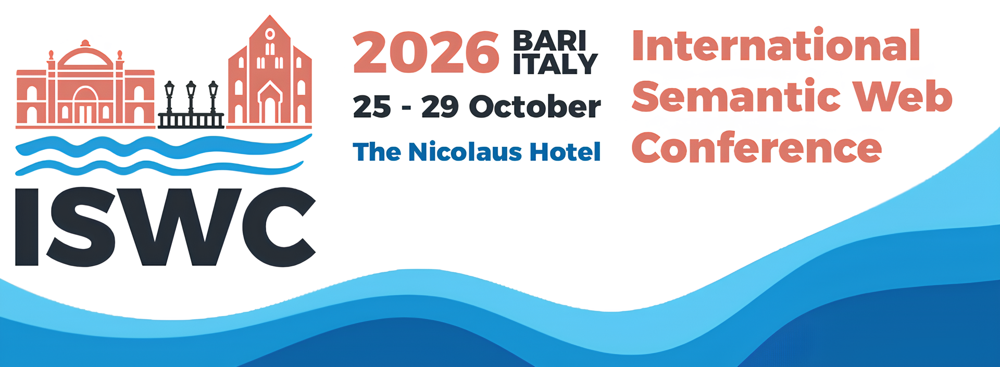

# ISWC 2026 Website

See you in Bari! 25 – 29 October 2026, International Semantic Web Conference.

**Live site:** https://iswc2026.semanticweb.org/



## Getting started

Requires Node 18 or newer.

```bash
npm install
npm run dev      # local dev server on http://localhost:3000
```

| Command          | What it does                                                  |
| ---------------- | ------------------------------------------------------------- |
| `npm run dev`    | Dev server with hot reload                                     |
| `npm run build`  | Production build into `build/`                                 |
| `npm run preview`| Serve the production build locally                             |
| `npm run smoke`  | Render every route and report anything that errors             |

Pushing to `main` builds and deploys to GitHub Pages automatically
(`.github/workflows/main.yml`). The smoke test runs first, so a page that
crashes will fail the build rather than ship broken.

## Stack

- **React 18** with **React Router** (`HashRouter`, required by GitHub Pages)
- **Vite** for building
- **Bootstrap 5** + custom SCSS for styling
- No CSS-in-JS, no Tailwind, no component library beyond `react-bootstrap`

## Project layout

```
src/
  styles/          Design system — start here for anything visual
    _tokens.scss     Colours, fonts, layout constants
    _theme.scss      Maps the tokens onto Bootstrap's variables
    _base.scss       Element defaults (headings, lists, links)
    _components.scss Site components (.iswc-*)
    _compat.scss     Temporary shim — see "Ongoing migration" below
    main.scss        Entry point; controls import order
  data/
    navigation.js      The navbar menu
    sponsors.js        Sponsors by tier
    importantDates.js  Deadlines shown on the Important Dates page
  components/
    general/       Shared building blocks used by every page
    about/         Homepage
    calls/         Call for papers pages
    program/       Programme pages (+ data/ for paper and workshop lists)
    guidelines/    Author guidelines
    attending/     Registration, venue, visa, conduct
    sponsorship/   Sponsor-facing pages
    organization/  Committee listings
```

## Common tasks

**Change a colour.** Edit `src/styles/_tokens.scss`. If JavaScript needs the
same value (the Important Dates timeline does), mirror it in `src/theme.js`.

**Add or hide a menu entry.** Edit `src/data/navigation.js`. Routes live
separately in `src/App.jsx`, so you can remove something from the menu while
keeping its URL reachable.

**Add a news item.** Prepend to the `NEWS` array in
`src/components/about/News.jsx` and move the `latest: true` flag to it.

**Add or change an important date.** Edit `src/data/importantDates.js`. Add the
entry anywhere in the list — months, ordering, the "next deadline" highlight and
the dimming of past dates are all derived from the ISO date, so there is nothing
to keep in sync. Use `endDate` for multi-day events.

**Write a new content page.**

```jsx
import Page from "../general/Page";
import Header from "../general/Header";
import UnderlineHeader from "../general/UnderlineHeader";

export default function MyPage() {
  return (
    <Page>
      <Header>Page title</Header>
      <p>Plain paragraphs and lists are styled globally — no classes needed.</p>
      <UnderlineHeader>A section</UnderlineHeader>
      <ul>
        <li>Write lists as a bare &lt;ul&gt; — never add classes for bullets,
            indentation or nesting. That is all handled globally.</li>
      </ul>
    </Page>
  );
}
```

Then register it in `src/App.jsx` and add it to `src/data/navigation.js`.

**Show a table of papers or workshops.** Use `general/DataTable`, or one of the
presets around it: `PaperTable` (title + authors + abstract),
`DescriptiveTable` (title + organisers + links), `TutorialTable` (adds a format
column). Rows collapse into cards on narrow screens automatically. Table-heavy
pages should use the wider shell: `<Page width="wide">`.

**List committee members.** Use `organization/CommitteeSection`, passing a map
of role to members. Set `hideImage` for name-only lists. Portraits are sized by
the stylesheet, so source images don't need cropping to a particular size.

**Add a keynote speaker.** Use `general/TalkHeading` for the section heading and
`general/SpeakerProfile` for the portrait-plus-biography block. Portraits are a
fixed 220x260 regardless of the source image, so speakers line up down the page.

**Add an image to a page.** Use `className="iswc-figure-img"` for a standalone
diagram or map, or `iswc-media-row` / `iswc-media-row__image` /
`iswc-media-row__text` for an image beside text. Don't set pixel sizes inline.

**Add an image.** Keep source images under about 1600px wide. Large photos were
a real problem here — the assets folder was 97 MB before being downscaled.

## Ongoing migration

The site was rebuilt on Bootstrap; the shared components and homepage are fully
converted. Individual content pages still carry Tailwind class names from the
previous codebase, and `src/styles/_compat.scss` reimplements just those classes
so the pages keep rendering correctly.

When you touch a page, convert it: replace the leftover utility classes with
Bootstrap equivalents or plain semantic HTML, then delete anything from
`_compat.scss` that is no longer referenced. That file should shrink to nothing
over time. Nothing should ever be added to it.

The two page-level stylesheets that used to live in `components/attending/` and
`components/sponsorship/` have been folded into `_components.scss`. They both
defined a global `.custom-table` with conflicting rules, so whichever loaded
last won across the whole site; they are now `.iswc-info-table` and
`.iswc-tiers-table` respectively.

Every class used on a live route resolves to a real definition. If you add
markup, keep it that way — a class that isn't defined anywhere renders at the
browser default, which is how photos ended up at full size during the
migration.
